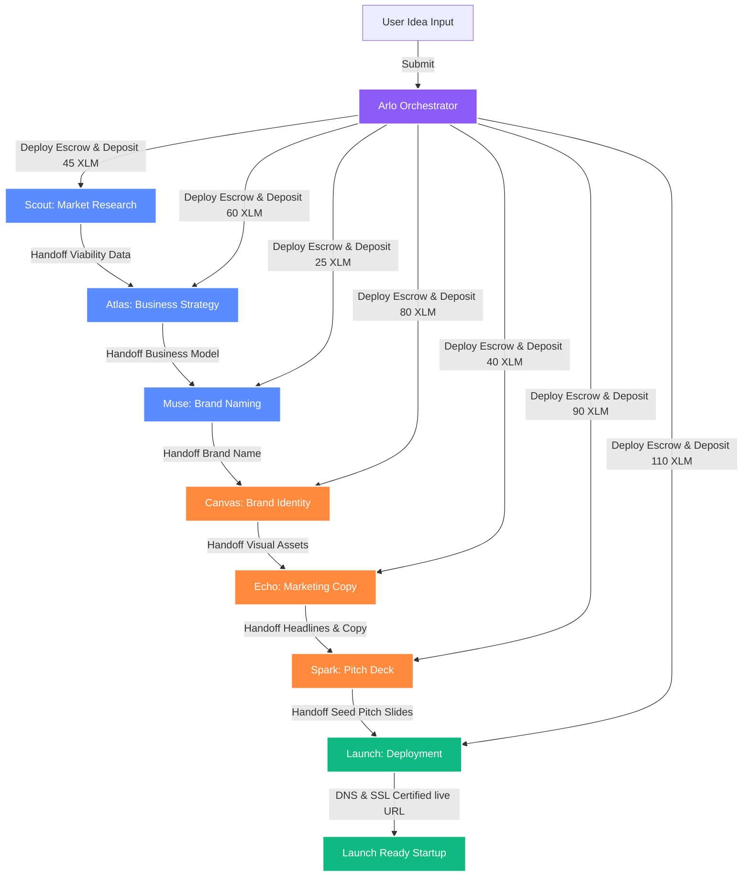

# Arlo: AI Venture Orchestrator on Stellar Soroban

Arlo is a modern, enterprise-grade AI Venture Orchestrator built on the **Stellar Network** and powered by **Soroban Smart Contracts**.

Arlo transforms single startup ideas into complete launch-ready businesses by autonomously coordinating multiple specialized AI agents. Instead of relying on a single large LLM context window, Arlo acts as the primary orchestrator that deploys, funds, and settles payments with independent AI specialists through secure, decentralized Soroban smart contract escrows using native **XLM** tokens.

---

## 1. Problem Statement

Monolithic LLM agents face severe context limits, reasoning degradation, and lack the specialization needed for true production-grade software and business output. Single-agent chatbots are locked to a single perspective, while custom multi-agent frameworks are usually hardcoded, non-scalable, and cannot handle autonomous agent-to-agent commerce or secure resource trading.

## 2. Solution: Autonomous Agent Commerce & Escrows

Arlo resolves this by decoupling the startup launch pipeline into a network of independent AI agent nodes that:
1. **Trade Compute & Deliverables**: Each agent publishes its capability schema and cost rate in native **XLM**.
2. **Deposit Escrow Releases**: The orchestrator secures payments inside decentralized Soroban smart contract escrows. Deposit funds are released to agent wallets only after the deliverables pass automated verification.
3. **Collaborate Peer-to-Peer**: The output of one agent is serialized and piped directly to the input handle of the next node.

---

## 3. Architecture Flow



---

## 4. Hired Agents & Rates

| Agent Name | Role | Native XLM Rate | Deliverable Output | Escrow Contract ID |
| :--- | :--- | :--- | :--- | :--- |
| **Scout** | Market Research | 45.0 XLM | TAM metrics, target demographics, viability indexes | `CC7R2X...1V` |
| **Atlas** | Business Strategy | 60.0 XLM | Lean business canvas, monetization loops, cost ratios | `CC3W7U...5Q` |
| **Muse** | Brand Naming | 25.0 XLM | Semantic name proposals, domain extension availability | `CCMUSE...5Q` |
| **Canvas** | Brand Identity | 80.0 XLM | Geometric vector logo assets, Tailwind palettes | `CCCANV...5Q` |
| **Echo** | Marketing Copy | 40.0 XLM | Value-prop grids, hero copywriting block components | `CCECHO...V1` |
| **Spark** | Pitch Deck | 90.0 XLM | VC presentation slides, problem/solution sheets | `CCSPAR...A6` |
| **Launch** | Deployment | 110.0 XLM | SSL security provisioning, custom domain mapping, live URL | `CCLAUN...J5` |

---

## 5. Technology Stack

* **Smart Contracts**: Soroban Smart Contracts framework (Rust, `soroban-sdk` v20.0.0)
* **Local Development & CLI**: `stellar-cli` for testing, building, and deploying contract WASM bytecodes
* **Stellar Interaction**: Horizon Client and Soroban RPC API integration endpoints
* **Frontend Framework**: Next.js 15 (App Router, React 19 Canary)
* **Styling**: Tailwind CSS v4 variables, soft Gaussian mesh gradients
* **Workflow Visuals**: React Flow v12 (`@xyflow/react`)
* **State Manager**: Zustand (persistent simulation cache)
* **Animations**: Framer Motion transitions

---

## 6. Directory Structure

```
arlo/
├── contracts/
│   └── escrow/                 # Soroban Escrow Smart Contract
│       ├── src/
│       │   └── lib.rs          # Escrow logic: initialize, release, refund in Rust
│       └── Cargo.toml          # Rust dependencies and WASM build profiles
├── src/
│   ├── app/
│   │   ├── globals.css         # Tailwind CSS v4 themes, blurs, and button layouts
│   │   ├── layout.tsx          # Space Grotesk & Inter font layout
│   │   ├── page.tsx            # Landing page with visual AgentCanvas
│   │   └── dashboard/
│   │       └── page.tsx        # Enterprise venture cockpit and live terminal logs
│   ├── components/
│   │   ├── landing/
│   │   │   ├── Navbar.tsx      # Sticky glass navigation header
│   │   │   ├── AgentCanvas.tsx # Hero visual: animated React Flow chain
│   │   │   ├── AgentGrid.tsx   # Specialist agent card grid
│   │   │   ├── Timeline.tsx    # Chronological timeline logs
│   │   │   └── Faq.tsx         # FAQ accordions detailing Soroban contracts
│   │   └── dashboard/
│   │       ├── DashboardSidebar.tsx # Minimal navigation with XLM balance widgets
│   │       ├── OrchestratorConsole.tsx # Monospace scrolling terminal streaming logs
│   │       ├── DeliverableTabs.tsx # Inspection tabs for venture artifacts
│   │       └── WalletLedger.tsx # Detailed table listing Stellar transactions
│   ├── lib/
│   │   ├── store.ts            # Zustand orchestration and contract settlement state
│   │   └── utils.ts            # Classnames clsx/tailwind-merge utility
├── package.json
└── tsconfig.json
```

---

## 7. Getting Started

### Smart Contract Setup

#### Prerequisites
* Install Rust and Cargo: `curl --proto '=https' --tlsv1.2 -sSf https://sh.rustup.rs | sh`
* Add target WASM: `rustup target add wasm32-unknown-unknown`
* Install the Stellar CLI: `cargo install --locked stellar-cli --features opt`

#### Building Contracts
Compile the escrow contract to target bytecode:
```bash
cd contracts/escrow
cargo build --target wasm32-unknown-unknown --release
```

#### Optimizing Contract Wasm
Optimize the compiled WASM binary for minimal ledger size limits:
```bash
stellar contract optimize --wasm target/wasm32-unknown-unknown/release/soroban_agent_escrow.wasm
```

#### Deploying to Stellar Testnet
Deploy optimized WASM contract bytecodes to Testnet network:
```bash
stellar contract deploy \
  --wasm target/wasm32-unknown-unknown/release/soroban_agent_escrow.optimized.wasm \
  --source your_stellar_account \
  --network testnet
```

---

### Frontend Setup

#### Prerequisites
* Node.js (version 18.0.0 or higher)
* npm or pnpm package manager

#### Installation
Install all venture dependencies:
```bash
npm install
```

#### Running Locally
Execute the Next.js development server:
```bash
npm run dev
```

Open `http://localhost:3000` in your web browser to interact with the landing page and launch dashboard.

---

## 8. Open Source Contributions

We welcome active contributions from the developer community! Here is how you can get involved:

### How to Contribute
1. **Fork the Repository**: Clone Arlo and create a new feature branch (`git checkout -b feature/your-feature-name`).
2. **Add Custom Agents**: Extend `INITIAL_AGENTS` in `src/lib/store.ts` to add specialized agents. Specify their roles, color tokens, and base XLM rates.
3. **Enhance Escrow Logic**: Open issues or PRs inside `contracts/escrow/src/lib.rs` to support multi-signature escrows, oracle verification triggers, or dynamic fee logic.
4. **Submit PRs**: Ensure all code compiles cleanly and matches project styling. Submit a detailed pull request description to the main branch.

---

## 9. License

This project is licensed under the MIT License. Details can be found in the LICENSE file.
<!-- docs: add note about testnet faucet funding -->
<!-- docs: add prerequisite list: Node 20+, Rust 1.70+, Stellar CLI -->

